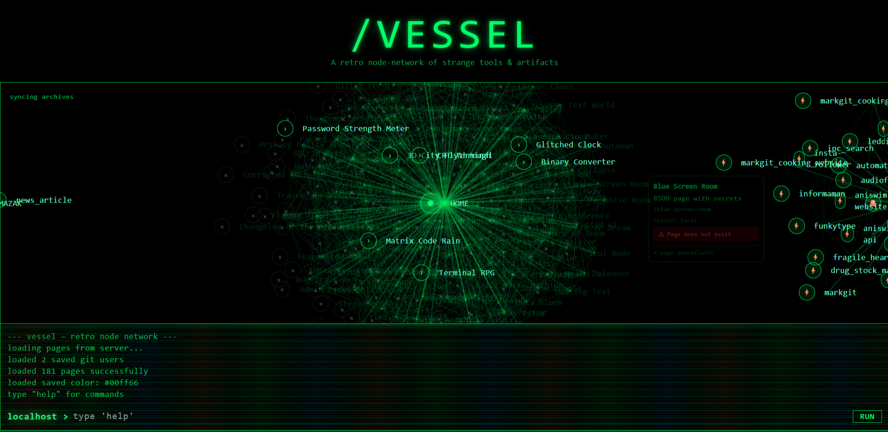

# 🚀 VESSEL — Retro Node Network

> **A retro node-network of strange tools & artifacts**

[](https://nodejs.org/)
[](https://expressjs.com/)

## 🌟 Overview

VESSEL is an interactive, retro-styled web application that creates a visual network of interconnected tools, games, and experiences. Built with a cyberpunk aesthetic featuring CRT effects, glitch animations, and a terminal interface, it serves as both a showcase of web technologies and an engaging user experience.



The application features a dynamic node-based interface where users can explore various pages, each representing different tools, games, or experiences. The interface supports real-time interaction, customizable color schemes, and a built-in terminal for navigation and commands.

## ✨ Key Features

### 🎮 Interactive Node Network
- **Dynamic Node Visualization**: Interactive network of interconnected pages and tools
- **Real-time Navigation**: Click, drag, and explore the network visually
- **Responsive Design**: Adapts to different screen sizes and devices
- **Pan & Zoom**: Navigate the network with mouse wheel zoom and drag panning

### 🖥️ Retro Terminal Interface
- **Built-in Terminal**: Full-featured terminal with command system
- **Command History**: Track and recall previous commands
- **Real-time Feedback**: Instant response to user input
- **Help System**: Comprehensive command documentation

### 🎨 Customizable Visual Experience
- **Dynamic Color Schemes**: Change accent colors via terminal commands
- **CRT Effects**: Authentic retro monitor aesthetics with scanlines and flicker
- **Glitch Animations**: Cyberpunk-style visual distortions and effects
- **Responsive Typography**: IBM Plex Mono font with proper scaling

### 🔗 Multi-Vessel Architecture
- **Local Vessel**: Built-in pages and tools
- **External Vessels**: Connect to other VESSEL instances
- **GitHub Integration**: Direct integration with GitHub repositories
- **Dynamic Loading**: Real-time addition and removal of vessels

### 📱 Responsive & Accessible
- **Mobile Optimized**: Touch-friendly interface for mobile devices
- **Keyboard Navigation**: Full keyboard support for accessibility
- **Screen Reader Friendly**: Proper ARIA labels and semantic structure
- **High Contrast**: Optimized for various visual preferences

## 🏗️ Architecture

### Backend (Node.js + Express)
```javascript
// Server setup with static file serving
const app = express();
app.use(express.static(path.join(__dirname, 'pages')));

// Dynamic page loading endpoint
app.get('/pages', (req, res) => {
    // Returns JSON of all available pages with existence validation
});

// Page routing with fallback to 404
app.get('/pages/:page', (req, res) => {
    // Serves HTML pages or redirects to external URLs
});
```

### Frontend (Vanilla JavaScript)
- **No Framework Dependencies**: Pure JavaScript for maximum performance
- **Modular Architecture**: Organized into logical sections (UI, terminal, networking)
- **Local Storage**: Persistent user preferences and vessel configurations
- **Real-time Updates**: Dynamic content loading without page refresh

### Data Structure
```javascript
// Page object structure
{
    id: 'unique-identifier',
    name: 'Display Name',
    desc: 'Description text',
    url: '/path-or-external-url',
    vesselName: 'source-vessel',
    exist: true/false // File existence validation
}
```

## 🎯 Existing Pages & Tools

### 🌐 WebGL & Visual Effects
- **3D City Flythrough**: Interactive cyberpunk city exploration with Three.js
- **CRT Terminal**: Realistic CRT screen shader with distortion effects
- **Matrix Code Rain**: Interactive falling code with clickable elements
- **Glitched Clock**: Time display with random visual distortions

### 🎮 Interactive Games
- **Terminal RPG**: Text-based adventure game with command progression
- **Password Strength Meter**: Animated password strength visualization
- **Binary Converter**: Visual text-to-binary conversion tool

### 🛠️ Utility Tools
- **Various Simulators**: Network tools, system simulations, and educational content
- **Creative Tools**: Image manipulation, text effects, and artistic utilities
- **Educational Content**: Hacking simulations, cryptography tools, and more

### 📚 Planned Features (from pages.js)
The project includes extensive planning for future pages across categories:
- Social/Network tools
- Data & OS simulations
- AR/VR experiences
- Sound & Music tools
- Story & Lore pages
- Interactive science tools
- Hidden/ARG mechanics
- Classic hacker tools

## 🚀 Getting Started

### Prerequisites
- **Node.js** 18+ 
- **npm** or **yarn** package manager
- Modern web browser with ES6+ support

### Installation

1. **Clone the repository**
   ```bash
   git clone <your-repo-url>
   cd vessel
   ```

2. **Install dependencies**
   ```bash
   npm install
   ```

3. **Start the development server**
   ```bash
   npm run dev
   ```

4. **Open your browser**
   Navigate to `http://localhost:3000`

### Production Deployment
```bash
npm start
```

## 🎨 Customization Guide

### Adding New Pages

1. **Create HTML file** in the `pages/` directory
   ```html
   <!DOCTYPE html>
   <html lang="en">
   <head>
       <meta charset="UTF-8">
       <meta name="viewport" content="width=device-width, initial-scale=1.0">
       <title>Your Page - Vessel</title>
       <style>
           /* Your custom styles */
       </style>
   </head>
   <body>
       <!-- Your page content -->
   </body>
   </html>
   ```

2. **Add page metadata** to `pages.js`
   ```javascript
   {
       id: 'your-page-id',
       name: 'Your Page Name',
       desc: 'Description of what your page does',
       url: '/your-page-id'
   }
   ```

3. **Restart the server** to see changes

### Creating Your Own Vessel

1. **Set up a new project** with the same structure
   ```
   your-vessel/
   ├── index.js          # Express server
   ├── index.html        # Main interface
   ├── pages.js          # Page definitions
   ├── pages/            # HTML pages directory
   └── package.json      # Dependencies
   ```

2. **Customize the interface** in `index.html`
   - Modify the title and branding
   - Adjust color schemes and styling
   - Add custom functionality

3. **Define your pages** in `pages.js`
   - Create unique page IDs
   - Write compelling descriptions
   - Organize by categories

4. **Deploy and share** your vessel URL

### Connecting Vessels

Use the terminal commands to connect multiple vessels:

```bash
# Add an external vessel
add vessel https://example.com

# List all connected vessels
vessels

# Remove a vessel
remove vessel vessel-name

# Reload all vessels
reload
```

### GitHub Integration

Connect GitHub repositories directly:

```bash
# Add a GitHub user
git add username

# List connected users
git list

# Refresh repositories
git refresh username

# Remove a user
git remove username
```

## 🎮 Terminal Commands

### Navigation Commands
- `help` - Show all available commands
- `list` / `ls` - Display all pages grouped by vessel
- `open <id|name>` - Open a specific page
- `find <term>` - Search pages by name or description
- `goto <slug>` - Navigate to page by ID

### Vessel Management
- `add vessel <url>` - Connect to external vessel
- `vessels` - List all connected vessels
- `remove vessel <name>` - Disconnect a vessel
- `reload` - Refresh all vessel data

### GitHub Commands
- `git add <username>` - Add GitHub user repositories
- `git list` - Show connected GitHub users
- `git remove <username>` - Remove GitHub user
- `git refresh <username>` - Update repository data

### View Controls
- `center` / `reset` - Reset view to center
- `map` - Refresh network connections
- `random` - Open a random enabled page
- `clear` - Clear terminal output

### Customization
- `color <hex>` - Change accent color (e.g., `color #ff0066`)
- `color reset` - Restore default green theme
- Named colors: `red`, `blue`, `cyan`, `magenta`, `yellow`, `orange`, `purple`, `pink`, `lime`, `teal`, `indigo`, `violet`

## 🎨 Styling & Theming

### Color System
The application uses CSS custom properties for dynamic theming:

```css
:root {
    --accent-primary: #00ff66;
    --accent-rgb: 0, 255, 102;
    --accent-dark: #00cc52;
    --accent-darker: #009940;
    --accent-light: #33ff80;
    --accent-lighter: #66ffaa;
    --accent-pale: #ccffdd;
}
```

### CRT Effects
- **Scanlines**: Moving horizontal lines for authentic CRT look
- **Flicker**: Subtle screen flickering animation
- **Color Shift**: RGB color channel variations
- **Glitch Effects**: Random visual distortions

### Typography
- **Primary Font**: IBM Plex Mono (monospace)
- **Fallback Fonts**: System monospace fonts
- **Responsive Sizing**: Scales appropriately for different screen sizes

## 🔧 Development

### Project Structure
```
vessel/
├── index.js              # Express server and routing
├── index.html            # Main application interface
├── pages.js              # Page definitions and metadata
├── pages/                # HTML page files
│   ├── 3d-city-flythrough.html
│   ├── binary-converter.html
│   ├── crt-terminal.html
│   ├── glitched-clock.html
│   ├── matrix-code-rain.html
│   ├── password-strength-meter.html
│   └── terminal-rpg.html
├── package.json          # Dependencies and scripts
├── package-lock.json     # Locked dependency versions
└── README.md             # This file
```

### Key Components

#### Node UI Engine
- **Dynamic Node Creation**: Generates interactive nodes from page data
- **Responsive Layout**: Automatically arranges nodes in optimal patterns
- **Drag & Drop**: Interactive node positioning and manipulation
- **Connection Rendering**: SVG-based network visualization

#### Terminal System
- **Command Parser**: Processes user input and executes commands
- **History Management**: Tracks command history and provides feedback
- **Dynamic Help**: Context-aware command assistance
- **Error Handling**: Graceful error messages and recovery

#### Vessel Management
- **Dynamic Loading**: Real-time vessel discovery and connection
- **Data Validation**: Ensures page existence and accessibility
- **Caching**: Local storage for performance optimization
- **Error Recovery**: Handles network issues gracefully

### Adding New Features

1. **Extend the terminal** with new commands
2. **Add new node types** for different content categories
3. **Implement new visual effects** using CSS animations
4. **Create custom page templates** for consistent styling

## 🚀 Deployment

### Environment Variables
Create a `.env` file for production configuration:

```env
PORT=3000
NODE_ENV=production
```

### Production Considerations
- **Static Asset Optimization**: Minify CSS/JS for production
- **CDN Integration**: Serve static assets from CDN
- **Caching Headers**: Implement proper cache control
- **Security Headers**: Add security middleware as needed

### Docker Deployment
```dockerfile
FROM node:18-alpine
WORKDIR /app
COPY package*.json ./
RUN npm ci --only=production
COPY . .
EXPOSE 3000
CMD ["npm", "start"]
```

#### Build the Docker image
```
docker build -t vessel-app .
```

#### Run the container
```
docker run -p 3000:3000 vessel-app
```

#### Or run in detached mode
```
docker run -d -p 3000:3000 --name vessel-container vessel-app
```
## 🤝 Contributing

### Development Workflow
1. **Fork the repository**
2. **Create a feature branch**
3. **Make your changes**
4. **Test thoroughly**
5. **Submit a pull request**

### Code Style
- **JavaScript**: ES6+ with consistent formatting
- **HTML**: Semantic markup with proper accessibility
- **CSS**: BEM methodology with CSS custom properties
- **Documentation**: Clear comments and README updates

### Testing
- **Browser Testing**: Test across different browsers and devices
- **Responsiveness**: Verify mobile and tablet compatibility
- **Performance**: Monitor load times and memory usage
- **Accessibility**: Ensure keyboard navigation and screen reader support

## 📱 Browser Support

- **Chrome**: 90+
- **Firefox**: 88+
- **Safari**: 14+
- **Edge**: 90+
- **Mobile**: iOS Safari 14+, Chrome Mobile 90+

## 🔒 Security Considerations

- **Input Validation**: All user input is sanitized
- **XSS Prevention**: Content Security Policy implementation
- **CSRF Protection**: Built-in Express security features
- **Rate Limiting**: Consider implementing for production use

## 📄 License

This project is licensed under the **ISC License**. See the [LICENSE](LICENSE) file for details.

## 🙏 Acknowledgments

- **Three.js**: 3D graphics library for WebGL experiences
- **IBM Plex Mono**: Beautiful monospace font family
- **Express.js**: Fast, unopinionated web framework
- **Tailwind CSS**: Utility-first CSS framework (CDN version)

## 🌟 Future Roadmap

### Planned Features
- **Real-time Collaboration**: Multi-user vessel exploration
- **Advanced Visualizations**: More complex network layouts
- **Mobile App**: Native mobile application
- **API Integration**: RESTful API for external integrations
- **Plugin System**: Extensible architecture for third-party tools

### Community Features
- **Vessel Marketplace**: Share and discover custom vessels
- **User Profiles**: Personalized experiences and preferences
- **Social Features**: Share discoveries and collaborate
- **Achievement System**: Gamification elements

---

**VESSEL** — Where the digital meets the retro, and every node tells a story.

*Built with ❤️ and lots of green text*
